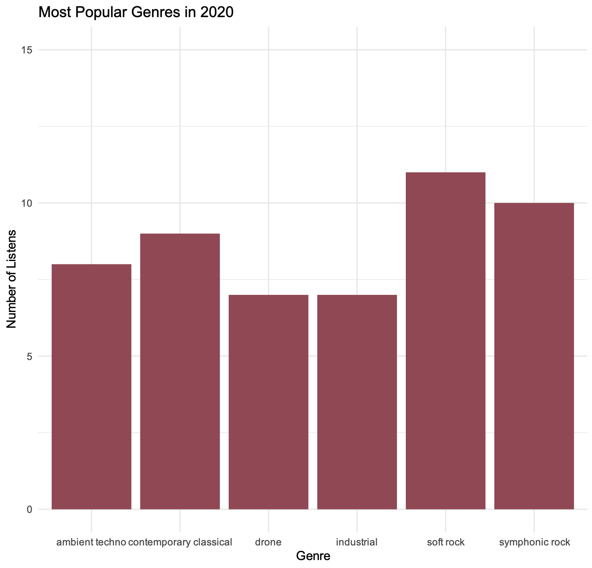
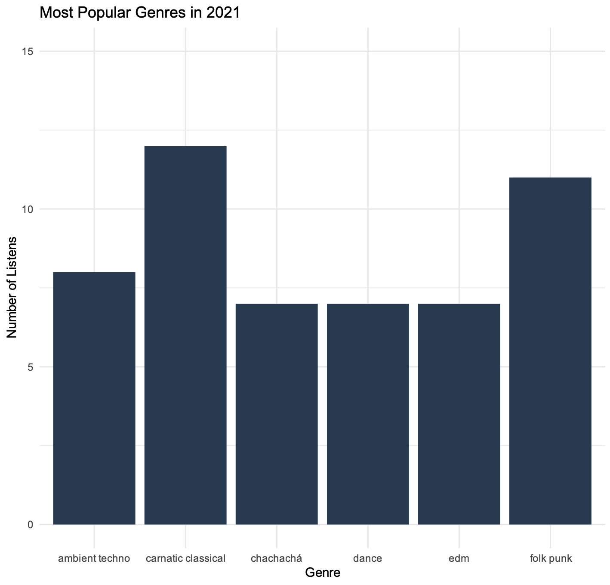
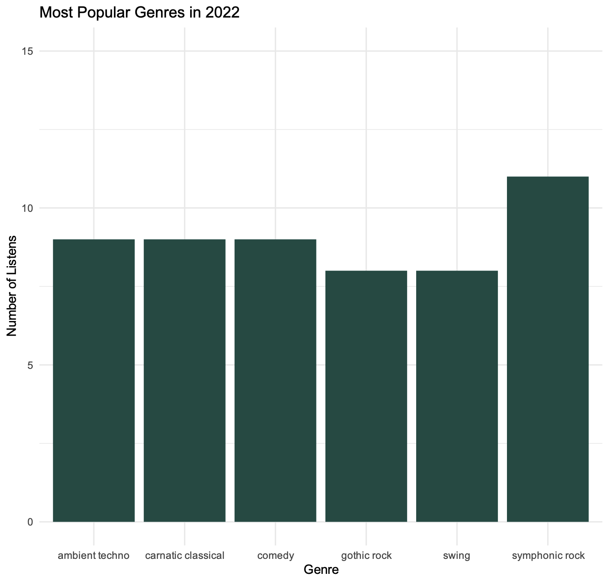
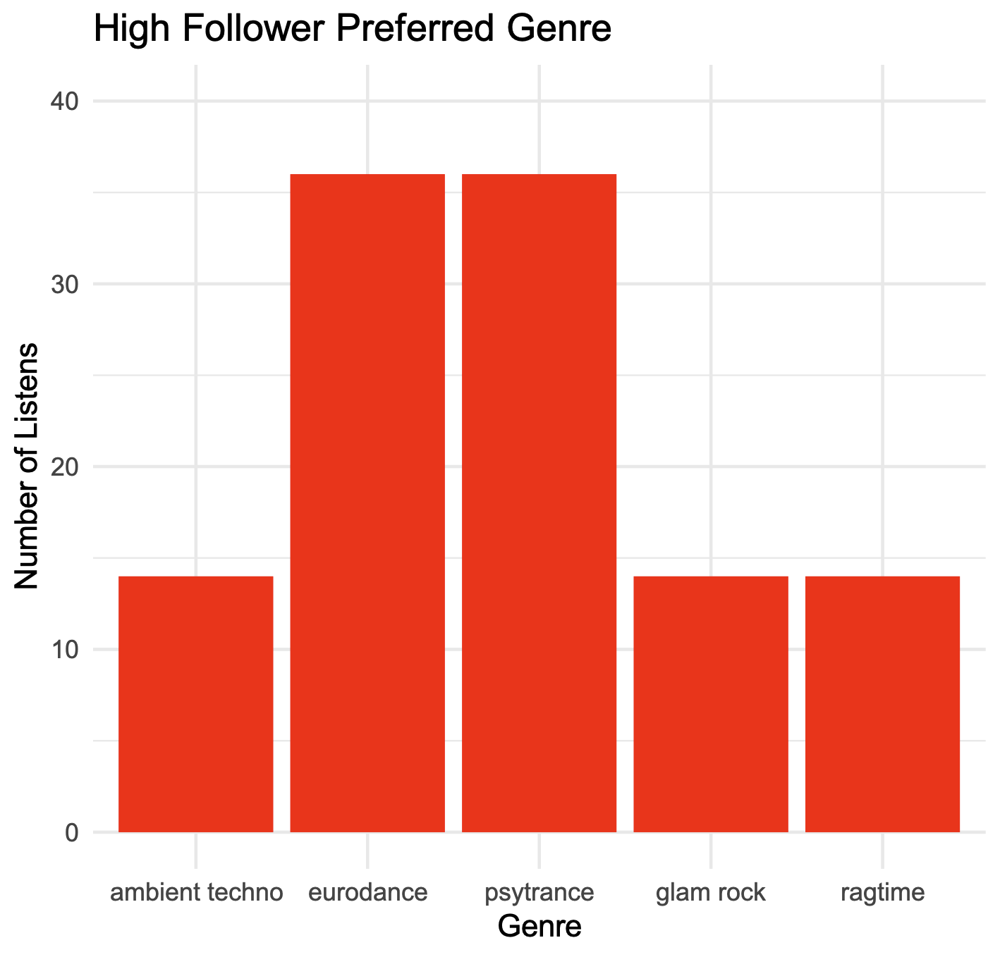
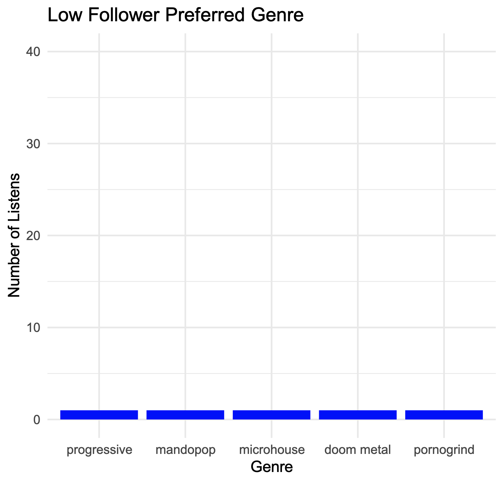
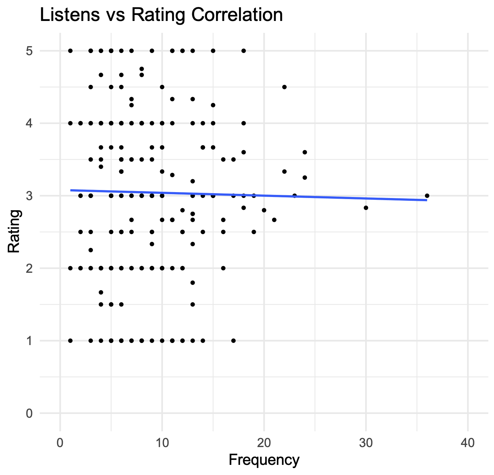

o# Data Analytics Planning

## What trends are we looking for?

- Most Listened to Genre By Year
  - Hypothesis: More sad/slow music was listened to during covid (2020)

- Friend correlation to Music Genre/PlayCount
  - Hypothesis: Do less followers lead to listening to sad/slow music and less listens

- High listen rate and Rating
  - Hypothesis: Are higher played artists rated higher?

## Data Needed

- Genre Popularity by Year
  - Genre Joined with Song Joined with Listened To
- Most Listened to Songs By Year
  - Song joined with listened to
- Friend Correlation to Genre
  - Followers joined with user joined with listened to joined with song joined to genre
- Highest Paid Artist
  - Listened to joined with song joined with artist joined with rating


## Most Listened to Genre By Year

```postgresql
select "Listened_to".listened_to_datetime,
"Listened_to".s_id,
Gs.g_id,
G.genrename
from "Listened_to"
INNER JOIN "Genre_s" Gs on "Listened_to".s_id = Gs.s_id
INNER JOIN "Genre" G on G.g_id = Gs.g_id
```

### Plots





### Analysis

From the plots it can be seen that listeners in 2020 were listening to more ambiance
related music and soft versions of more up beat genres. This correlates to how during the 
initial portion of the pandemic, people were inside and weren't out with friends
partying or listening to more upbeat music. In 2021, genres like dance, chachacha, and edm became
more prevalent as the users were getting together and dancing. These upbeat genres
correlates to what was popular at that time. In 2022 people started smoothing out their
listening, going back to what they listened to in 2020 with ambient techno and 
symphonic rock. However alongside these slower genres our users really seemed to enjoy 
gothic rock, swing, and comedy which are all faster more positive genres. All in all
it is difficult to make a definite claim based on the data provided as listening to 
samples from each genre. In addition adding more than five genres and using data from the previous
years can help build these definite claims. Unfortunately due to lack of data this hypothesis 
cannot be definitely proven.

## Friend Count to Genre

```postgresql
select "Follows".follows,
       Lt.listened_to_datetime,
       Lt.s_id,
       Gs.g_id,
       G.genrename
FROM "Follows"
INNER JOIN "Listened_to" Lt on "Follows".follows = Lt.u_id
INNER JOIN "Genre_s" Gs on Lt.s_id = Gs.s_id
INNER JOIN "Genre" G on G.g_id = Gs.g_id
```

### Plots



### Analysis

While the initial claim of genre listened to vs friend count is difficult to prove due to lack
of analysis on what each genre sounds like, the data yielded interesting results. 
It can very easily be shown that the more followers you have, the higher likelihood that you
will play more music. Our higher followed users listened to primarily upbeat music whereas
the lower followed users listened to more drill/metal style music with significantly less listens.

## Popular Artist Rating

- Artist Rating
```postgresql
select "Rate".s_id,
       "Rate".rating,
       Ps.ar_id,
       A."Name"
from "Rate"
INNER JOIN "Produces_s" Ps on "Rate".s_id = Ps.s_id
INNER JOIN "Artist" A on A.ar_id = Ps.ar_id
```
- Artist Listen
```postgresql
select "Listened_to".listened_to_datetime,
Ps.ar_id,
A."Name"
from "Listened_to"
INNER JOIN "Produces_s" Ps on "Listened_to".s_id = Ps.s_id
INNER JOIN "Artist" A on A.ar_id = Ps.ar_id
```

### Plot


### Analysis

The initial hypothesis of higher played artists would be rated higher unfortunatly could not be proven.
The regression line splits the data points in half, without showing any specific trend.
This could be because the rating data was randomized without the actual user base rating each song.
The expected trend was to see a positive correlation between the number of listens and average rating.
  